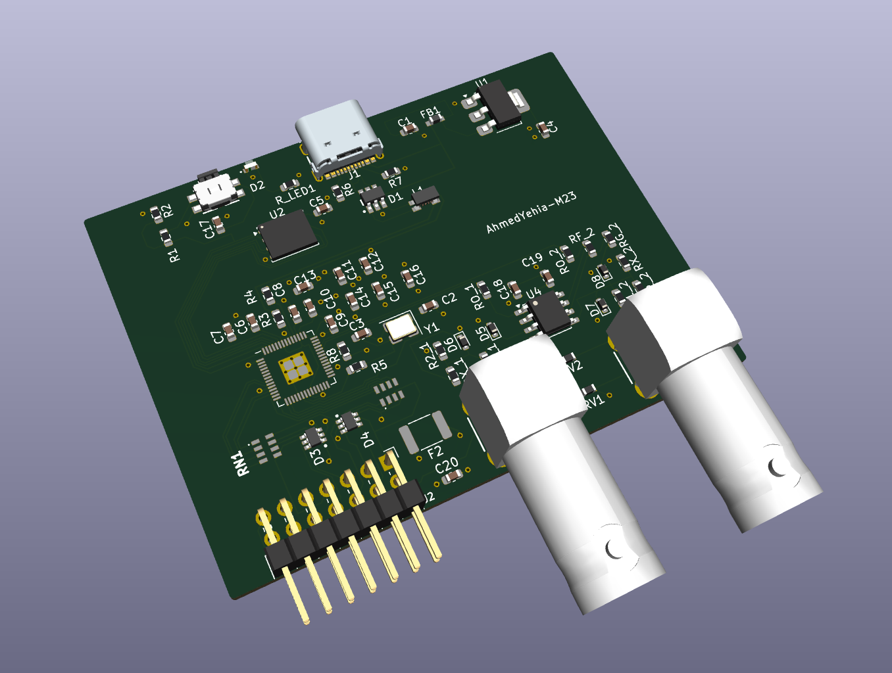
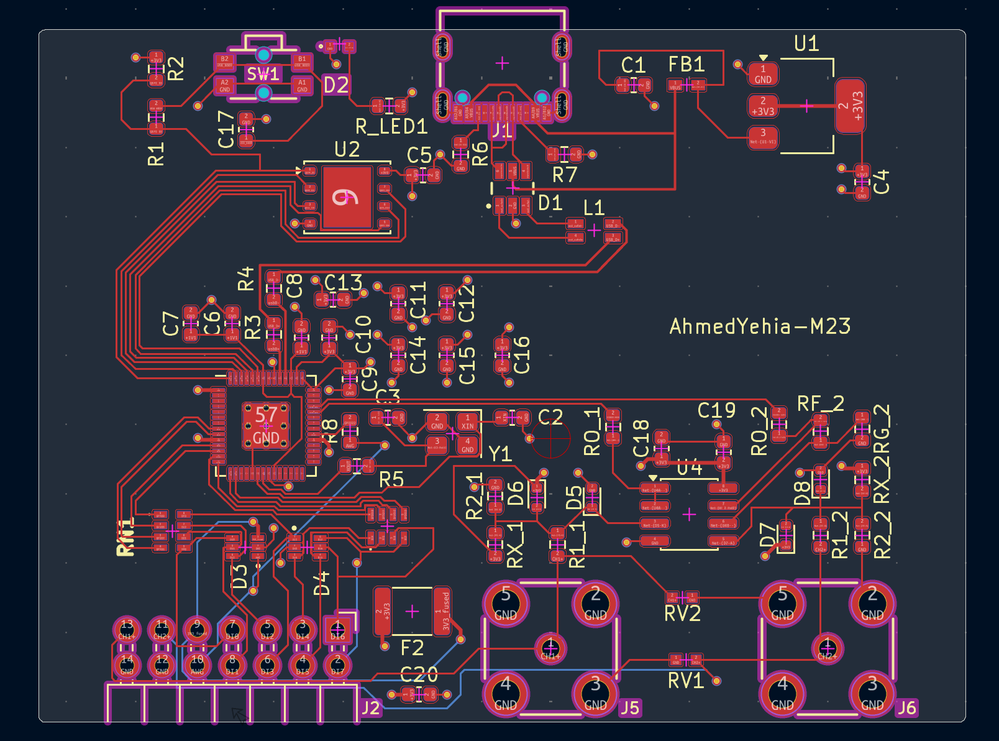
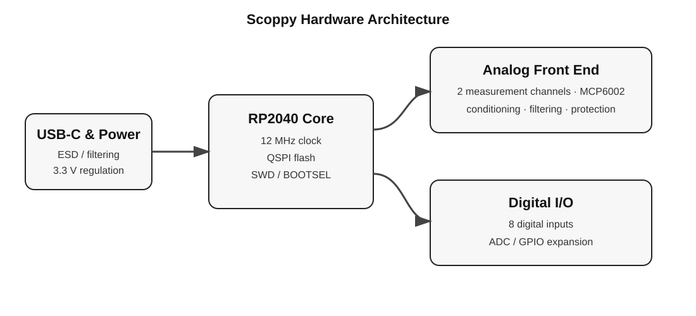

# Custom RP2040 Mixed-Signal Measurement PCB

**4-layer RP2040 hardware · KiCad · mixed-signal PCB layout · USB-C · hand assembly · hardware bring-up**

A university PCB-layout and hardware-bring-up project based on **professor-provided electrical schematics** for a custom RP2040 measurement board associated with the Scoppy oscilloscope ecosystem. My work was the **PCB implementation and physical hardware workflow**: placement, 4-layer stack-up and routing, fabrication preparation, hand assembly, bring-up and fault isolation.

| | |
|---|---|
| **Board** | 67 × 50 mm, 4 layers |
| **MCU** | RP2040 with W25Q128 QSPI flash |
| **Layout** | 64 footprints · 597 routed track segments · 58 vias |
| **Internal planes** | GND on In1.Cu · +3V3 on In2.Cu |
| **Academic context** | Materials and Manufacturing of Electronics · Summer Semester 2026 |



### Quick links

- [PCB layout source](hardware/Scoppy.kicad_pcb)
- [PCB layout image](images/pcb-layout.png)
- [Bring-up and debugging notes](docs/bring-up-and-debugging.md)
- [Source attribution](SOURCE_ATTRIBUTION.md)

> The electrical schematics and circuit/component-level design were supplied as course material. They are not redistributed here. The PCB placement, routing, assembly and bring-up documented in this repository are my project work.

## My contribution

- 4-layer PCB stack-up and physical implementation in KiCad
- complete component and footprint placement
- all PCB routing
- internal GND and +3V3 plane implementation
- mixed-signal physical-layout decisions
- board outline and physical organization
- design-rule checking and fabrication preparation
- complete hand assembly and soldering after fabrication
- board bring-up and electrical measurements
- USB-enumeration fault investigation
- power, continuity, USB, boot and clock checks
- root-cause isolation to incomplete RP2040 solder contact
- repair and restoration of USB enumeration

## PCB layout



## Architecture



The supplied course design was organized into hierarchical **Power**, **Digital** and **Analog** schematic sheets. My task was to translate those circuit requirements into a manufacturable 4-layer PCB while managing placement, signal routing, return paths, power distribution and physical board constraints.

## Assembly and bring-up

After fabrication, I assembled and hand-soldered the complete board. The first assembled board powered up but failed to enumerate over USB, including BOOTSEL attempts.

The diagnostic sequence covered:

- 5 V, 3.3 V and RP2040 1.1 V rails
- RUN / BOOTSEL state
- external-flash related circuitry
- USB-C CC configuration
- D+ / D- continuity and short checks
- RP2040 grounding and exposed-pad contact
- 12 MHz crystal network
- physical MCU solder contact

The final root cause was incomplete electrical contact at the RP2040 package. Correcting the solder/contact defect **restored USB enumeration**.

The detailed check sequence and the boundary of the available evidence are documented in [`docs/bring-up-and-debugging.md`](docs/bring-up-and-debugging.md).

## Public project files

```text
hardware/
├── Scoppy.kicad_pro
├── Scoppy.kicad_pcb
├── fp-lib-table
└── LIB/
    └── footprints/
        └── DME_Template.pretty/

docs/
└── bring-up-and-debugging.md

images/
├── architecture.svg
├── pcb-layout.png
└── pcb-3d-view.png
```

Professor-provided schematic source and symbol/cache files are intentionally excluded from the public portfolio repository. Per-user KiCad state files, lock files, autosaves, backups and operating-system metadata are also excluded.

## Tools and skills

`KiCad` · `RP2040` · `4-Layer PCB Layout` · `Component Placement` · `Manual PCB Assembly & Soldering` · `Mixed-Signal PCB Routing` · `Internal Power/Ground Planes` · `USB-C` · `Hardware Bring-Up` · `Fault Isolation` · `Continuity & Voltage Measurement`

## Scoppy attribution

**Scoppy** is a separate project maintained by **fhdm-dev**. I did not develop the Scoppy Android application or its firmware. This repository presents my university PCB-layout, assembly and hardware-bring-up work and is not affiliated with or endorsed by the original Scoppy maintainers.
